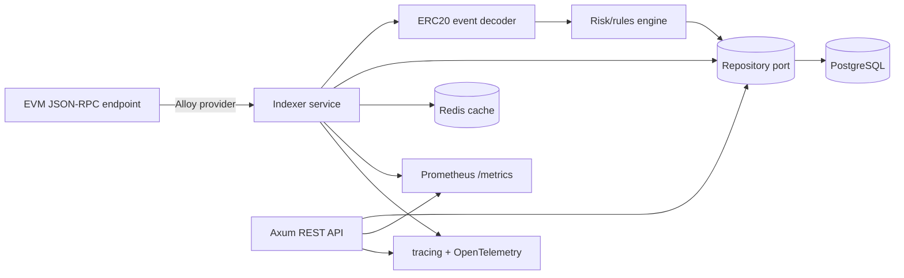

# chainwatch-rs

`chainwatch-rs` is a production-oriented Rust blockchain intelligence and transaction monitoring platform for Ethereum-compatible chains. It ingests EVM blocks, transactions, receipts, and logs; decodes ERC20 events with Alloy; persists indexed data in PostgreSQL; evaluates risk rules; and exposes operational REST APIs with tracing and Prometheus metrics.

The architecture is designed for production fintech and Web3 infrastructure: explicit ports/adapters, idempotent persistence, restart-safe indexer state, reorg-safe confirmations, typed configuration, graceful shutdown, structured logs, and testable domain logic.

## Architecture



### Module layout

- `domain` — core types, validation helpers, error taxonomy.
- `application` — repository/blockchain/decoder ports plus application services.
- `infrastructure` — Alloy RPC client, PostgreSQL repository, Redis cache, in-memory test repository.
- `indexer` — ingestion loop and ERC20 decoder.
- `risk` — clean rule engine with large-transfer, watchlist, high-frequency, and contract-risk hook rules.
- `api` — Axum handlers and DTOs. Handlers delegate business logic to ports/services.
- `config` — typed env-driven settings.
- `telemetry` — tracing, optional OTLP export, Prometheus recorder.

## Core capabilities

- Connects to configurable EVM RPC endpoints with Alloy.
- Backfills from `CHAINWATCH__INDEXER__START_BLOCK`.
- Indexes only blocks older than `CHAINWATCH__INDEXER__REORG_CONFIRMATIONS`.
- Stores blocks, transactions, logs, decoded events, token transfers, watchlist, alerts, and cursor state.
- Uses idempotent inserts/upserts for restart-safe ingestion.
- Decodes ERC20 `Transfer` and `Approval` events.
- Generates alerts for:
  - large transfer thresholds,
  - watched wallet activity,
  - high-frequency transfers,
  - suspicious contract interaction hook for future contract-risk/ML models.
- Exposes REST APIs:
  - `GET /health`
  - `GET /metrics`
  - `GET /blocks/latest`
  - `GET /transactions/{hash}`
  - `GET /addresses/{address}/transfers?limit=50&offset=0`
  - `GET /tokens/{address}/transfers?limit=50&offset=0`
  - `GET /alerts?limit=50&offset=0`
  - `POST /watchlist`
  - `DELETE /watchlist/{address}`

## Quick start

```bash
cp .env.example .env
# edit CHAINWATCH__EVM__RPC_URL to a real Ethereum-compatible RPC endpoint
docker compose up --build
```

The API listens on `http://localhost:8080`.

Example watchlist command:

```bash
curl -s -X POST http://localhost:8080/watchlist \
  -H 'content-type: application/json' \
  -d '{"address":"0x0000000000000000000000000000000000000001","label":"demo-case"}' | jq
```

Fetch alerts:

```bash
curl -s 'http://localhost:8080/alerts?limit=25' | jq
```

## Local development

Requires Rust stable, Docker, and PostgreSQL/Redis if running the full app.

```bash
make fmt
make check
make test
make clippy
make build
```

Run locally against Docker services:

```bash
docker compose up -d postgres redis
cp .env.example .env
cargo run
```

## Configuration

All settings are env vars under the `CHAINWATCH__` prefix. Nested fields use `__` separators.

Important settings:

| Variable | Purpose |
| --- | --- |
| `CHAINWATCH__APP__MODE` | `api`, `indexer`, or `all` |
| `CHAINWATCH__DATABASE__URL` | PostgreSQL DSN for the least-privilege app user |
| `CHAINWATCH__REDIS__URL` | Optional Redis URL for cached cursor hints |
| `CHAINWATCH__EVM__RPC_URL` | EVM JSON-RPC endpoint |
| `CHAINWATCH__EVM__CHAIN_ID_OVERRIDE` | Optional chain id override; otherwise calls `eth_chainId` |
| `CHAINWATCH__INDEXER__START_BLOCK` | First block to ingest when no cursor exists |
| `CHAINWATCH__INDEXER__REORG_CONFIRMATIONS` | Confirmation depth before indexing |
| `CHAINWATCH__INDEXER__BACKFILL_BATCH_SIZE` | Blocks per ingestion batch |
| `CHAINWATCH__RISK__LARGE_TRANSFER_THRESHOLD_WEI` | Alert threshold for ERC20 transfer amount |
| `CHAINWATCH__TELEMETRY__OTLP_ENDPOINT` | Optional OTLP gRPC endpoint |

Secrets are not printed by startup logs. RPC URLs persisted to `chains` are redacted.

## Database

Migrations live in `migrations/`. The schema includes:

- `chains`
- `blocks`
- `transactions`
- `logs`
- `decoded_events`
- `token_transfers`
- `watchlist`
- `alerts`
- `indexer_state`

Indexes are added for common API and risk queries. Hashes/addresses are stored as normalized text, and 256-bit integer values are stored as decimal strings to avoid precision loss.

## Reorg and restart strategy

- The indexer only persists blocks up to `latest - reorg_confirmations`.
- Cursor state is stored in `indexer_state` after each successful batch.
- Inserts are idempotent, so repeating a batch after a crash is safe.
- On startup/batch, the latest persisted hash is compared against the remote block hash. If it differs, data above `latest_block - reorg_confirmations` is rolled back and reprocessed.
- Alerts tied to rolled-back blocks are removed with the affected indexed data.

## Observability

Prometheus metrics:

- `chainwatch_latest_indexed_block`
- `chainwatch_blocks_indexed_total`
- `chainwatch_transactions_indexed_total`
- `chainwatch_rpc_errors_total`
- `chainwatch_alerts_generated_total`
- `chainwatch_indexing_lag_blocks`

Structured JSON logs are enabled by default with request IDs. Set `CHAINWATCH__TELEMETRY__OTLP_ENDPOINT=http://otel-collector:4317` to export OpenTelemetry traces.

## Security notes

- No private keys are required or accepted in this version.
- Address/hash inputs are validated before repository calls.
- API has global token-bucket rate limiting middleware.
- CORS is configurable.
- Docker Compose creates a non-superuser app role (`chainwatch_app`) and grants only DB/schema privileges needed for migrations and runtime.
- Do not put provider tokens directly in committed `.env` files.

## Testing

Current test coverage includes:

- risk rule unit tests,
- ERC20 decoder unit tests,
- API tests with in-memory repository,
- indexer tests with a mocked blockchain client,
- repository tests for memory and optional PostgreSQL integration when `CHAINWATCH__DATABASE__URL` is set.

Run:

```bash
cargo test --all-features
```

## Future enterprise hooks

The core ingestion, decoding, persistence, API, and rules engine are implemented. Future enterprise additions that are intentionally left as hooks:

- contract bytecode/ABI enrichment pipeline,
- ML-driven wallet/entity risk scores,
- cross-chain entity resolution,
- Kafka/NATS event bus sinks,
- tenant-aware authorization and audit trails.
